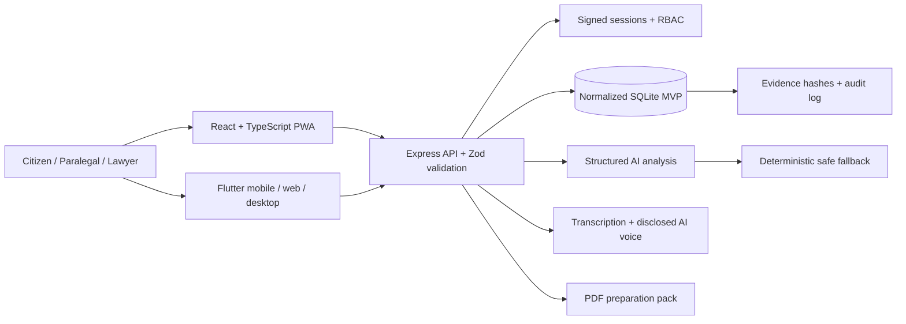

# Katiba OS

**The intelligent legal operating system for East Africa.**

Katiba OS is a hackathon-ready legal workflow platform that turns everyday evidence into explainable, reviewable legal work. Its flagship Justice Engine guides a Kenyan small-claims user from plain-language intake to an evidence-linked preparation pack, while lawyer and paralegal workspaces add the human review gate that responsible legal AI needs.

The same platform also demonstrates Contract, Compliance, and Evidence engines on a shared trust layer. Katiba OS is one product—not a collection of chatbots.

> Katiba OS is a preparation and decision-support prototype. It does not provide final legal advice, predict case outcomes, or file documents with a court.

## What is working

- Three role-based demos: citizen, paralegal, and lawyer
- Guided English/Kiswahili small-claims intake with validation, consent, and real microphone transcription
- AI-generated spoken case summaries, visibly disclosed as synthetic voice
- Evidence categorization, integrity checksums, linked chronology, and audit trail
- Explainable AI findings with strengths, gaps, confidence, and vetted sources
- Human approval workflow for legal professionals
- Branded three-page PDF preparation pack
- Contract health, clause risk, and obligation demonstration
- Platform view for Justice, Contract, Compliance, and Evidence engines
- Analytics and security/trust workspaces
- Installable PWA shell, responsive layouts, dark mode, keyboard focus, and reduced-motion support
- Adaptive Flutter client for Android, iOS, web, Windows, macOS, and Linux from one codebase
- Secure session signing, role checks, input schemas, security headers, normalized SQLite data, and API tests

## Run it

Requirements: Node.js 24 and npm. Flutter 3.44+ is required only for the cross-platform client.

```bash
npm install
npm run dev
```

Open `http://localhost:5173`. The web app proxies API requests to `http://localhost:8787`.

For the production-style build:

```bash
npm run build
npm start
```

Open `http://localhost:8787`.

Run the Flutter client against the local API:

```powershell
cd apps/katiba_flutter
flutter run --dart-define=KATIBA_API_URL=http://10.0.2.2:8787
```

Use `http://127.0.0.1:8787` instead on Flutter web or desktop. See [the Flutter client guide](apps/katiba_flutter/README.md) for platform commands.

## Demo roles

| Role | Persona | Best demo path |
|---|---|---|
| Citizen | Amina Wanjiku | Dashboard → case → evidence map → download pack |
| Paralegal | Njeri Kamau | Review queue → verify gaps → approve workflow |
| Lawyer | David Mwangi | Lawyer workspace → legal sources → professional approval |

Demo access is intentionally one-click. The API still issues an expiring HMAC-signed session and enforces authorization on every protected route.

## Optional live AI

The prototype works without any external service. Copy `.env.example` to `.env`, add `OPENAI_API_KEY`, and restart the API to enable structured analysis through the OpenAI Responses API, speech transcription, and synthetic voice playback. The key remains server-side.

The AI contract is deliberately narrow:

- organize only supplied facts and evidence metadata;
- return schema-validated JSON;
- never predict success or invent dates;
- never manufacture legal citations;
- fall back to deterministic analysis if the model is unavailable;
- keep a visible human-review gate.

## Architecture



See [docs/ARCHITECTURE.md](docs/ARCHITECTURE.md) for boundaries, data model, and production evolution.

## Verification

```bash
npm run lint
npm test
npm run build

cd apps/katiba_flutter
dart format --output=none --set-exit-if-changed lib test
flutter analyze
flutter test
flutter build apk --debug --dart-define=KATIBA_API_URL=https://katiba-os-api.onrender.com
flutter build web --release --dart-define=KATIBA_API_URL=https://katiba-os-api.onrender.com
```

Current verified result: 11 API/security tests and 5 Flutter tests passing, clean web and Flutter static analysis, successful React PWA production build, Flutter web release build, and Android APK build.

## Legal-source policy

Legal sources displayed in the demo are allow-listed by the product, not generated by the model. The seeded flagship flow links to the [Small Claims Court Act on Kenya Law](https://new.kenyalaw.org/akn/ke/act/2016/2/eng@2021-03-30) and the [Judiciary small-claims forms](https://judiciary.go.ke/download/small-claims-court-form/). A deployed service must add a maintained legal-content pipeline, jurisdiction/version metadata, and lawyer sign-off.

## Prototype versus production

| MVP now | Production path |
|---|---|
| SQLite and metadata-only evidence records | PostgreSQL plus encrypted object storage and key management |
| Signed demo session | OIDC/passkeys, MFA, secure cookies, tenant isolation |
| PWA shell and cached API reads | Encrypted offline queue with conflict resolution and background sync |
| Allow-listed Kenyan sources | Versioned legal knowledge service with editorial workflow |
| In-process analysis | Isolated workers, malware scanning, OCR, queues, observability |
| Local API | TLS ingress, WAF, rate limits, secrets manager, backups, disaster recovery |

## Judge kit

- [Demo script](docs/DEMO_SCRIPT.md)
- [Architecture and security](docs/ARCHITECTURE.md)
- [Pitch narrative](docs/PITCH.md)
- [Judging-criteria matrix](docs/JUDGING_MATRIX.md)
- [Render, Cloudflare, database, and environment runbook](docs/DEPLOYMENT.md)
- [Verified release status](docs/RELEASE_STATUS.md)

## Technology

React 19, TypeScript, Vite, Flutter 3.44, Dart 3.12, Express 5, Node SQLite, Zod, OpenAI SDK, PDF-Lib, Recharts, Vitest, Oxlint, and a service-worker PWA.
