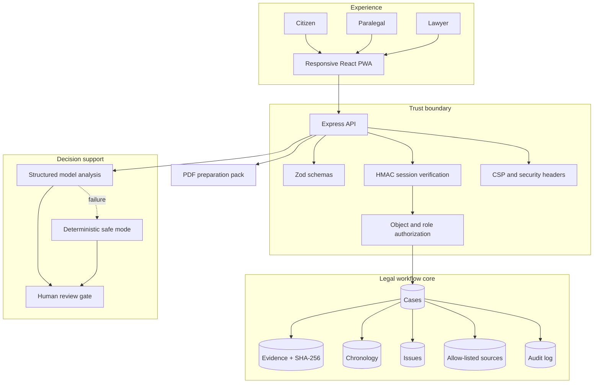
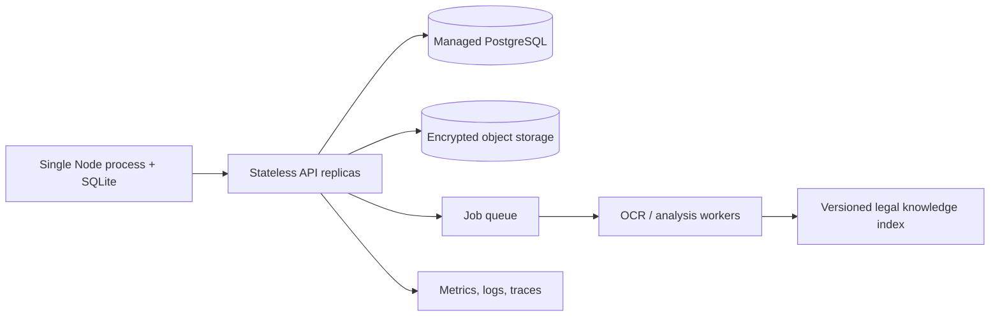

# Katiba OS architecture and security

## Design goal

Katiba OS separates four concerns that legal AI demos often blur: source evidence, deterministic workflow rules, model-generated organization, and human legal judgment. The MVP is deliberately compact enough to run locally while preserving production-grade boundaries.

## Data model

| Entity | Purpose | Key safeguards |
|---|---|---|
| `users` | Citizen and professional identities | unique email, restricted role enum |
| `cases` | Claim facts, status, jurisdiction, readiness | ownership checks and bounded values |
| `evidence` | File metadata and extracted text | SHA-256 checksum, size/type/category fields |
| `timeline_events` | Evidence-linked chronology | confidence plus stored evidence IDs |
| `legal_issues` | Strengths, attention items, missing facts | controlled severity values |
| `citations` | Vetted legal authorities | explicit source, section, URL, proposition |
| `audit_log` | Consent, analysis, drafting, review events | actor, timestamp, and detail |

## Authorization model

- Citizens may access only their own case and may start intake.
- Paralegals and lawyers may review the shared case queue.
- Only professional roles may change a case’s review status.
- Every protected API route verifies an expiring signed token.
- Object authorization is checked after authentication; role alone is not sufficient for claimant data.

The demo login is intentionally passwordless for judging. Production authentication must use OIDC or passkeys, MFA for professionals, secure HTTP-only cookies, revocation, device/session management, and organization-level tenant isolation.

## AI safety contract

1. Inputs are limited to the case narrative and supplied evidence metadata/text.
2. The model returns strict structured output: summary, chronology, issues, and next action.
3. The prompt forbids invented dates, success predictions, unsupported proof claims, and final advice.
4. Timeline evidence references are filtered against real submitted IDs.
5. Legal sources are attached by the application from a vetted allow-list.
6. Any model or parsing failure falls back to deterministic behavior.
7. The result stays a draft until a legal professional verifies it.

## Security posture

Implemented in the MVP:

- HMAC signatures with timing-safe comparison and eight-hour expiry;
- route-level authentication and role/object authorization;
- strict payload limits and Zod validation;
- CSP, no-sniff, referrer, and permissions headers;
- CORS restricted to local development origins;
- foreign keys, integrity constraints, WAL, and normalized storage;
- evidence metadata checksums and attributable audit events;
- no API key required for the complete deterministic demo.

Required before handling real client data:

- TLS everywhere, managed keys, encrypted database/object storage, and secrets management;
- malware scanning, safe file parsing, DLP, retention, deletion, and legal-hold policies;
- MFA, SSO, scoped tenants, row-level controls, and privileged-access monitoring;
- rate limits, WAF, centralized logs, anomaly detection, backups, and incident response;
- DPIA, processor agreements, data residency review, privilege/confidentiality policy, and independent penetration testing.

## Scale path

The first production slice should remain the small-claims workflow. Contract review can be the first paid cross-subsidy product, while Compliance and Evidence engines mature behind the same identity, source, and audit infrastructure.
